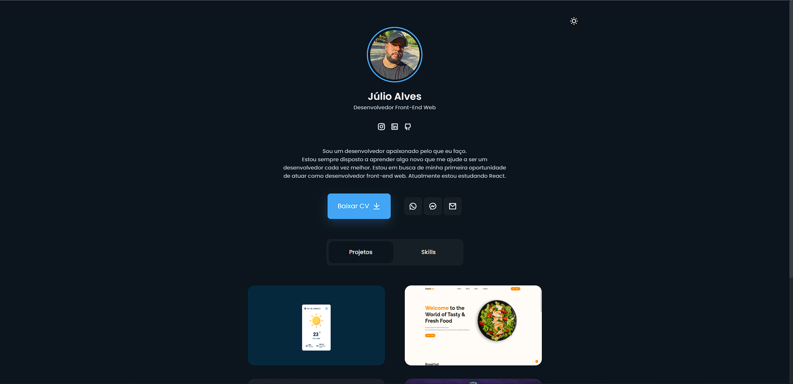
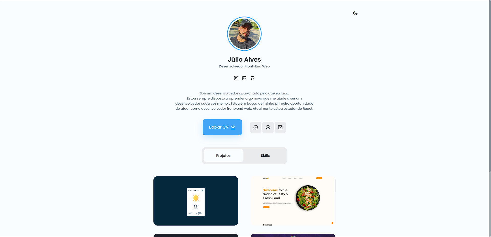

<h1 align="center">
   Portfólio | Júlio Alves
</h1>

<p align="center">
  <a href="#-technologies">Technologies</a>&nbsp;&nbsp;&nbsp;|&nbsp;&nbsp;&nbsp;
  <a href="#-layout">Getting started</a>&nbsp;&nbsp;&nbsp;|&nbsp;&nbsp;&nbsp;
  <a href="#-project">Project</a>
</p>

<br>

## Site Demonstration

<p align="center">
  
</p>

---

<p align="center">
  
</p>

## 🧪 Technologies

This project was developed using the following technologies:

- [Javascript](https://#)
- [HTML](https://#)
- [CSS](https://#)

## 🚀 Getting started

Clone the project and access the folder.

```bash
gh repo clone JulioAlvesRJ/Portfolio_JulioAlves
```

Follow the steps below

1.  Go to the project on VsCode and run with LiveServer extension.

2.  Or [Click on this link to enter the site](https://github.com/JulioAlvesRJ/Portfolio_JulioAlves)

## 💻 Project

Responsive Portfolio Website
Responsive Personal Portfolio Website Using HTML CSS & JavaScript
Smooth scrolling
Includes a light and dark mode.
Developed first with the Mobile First methodology, then for desktop.
Compatible with all mobile devices and with a beautiful and pleasant user interface.

## 📝 License

This project is licensed under the MIT License. See the [LICENSE](LICENSE.md) file for details.

---

<p align="center">Made by Júlio Alves</p>
